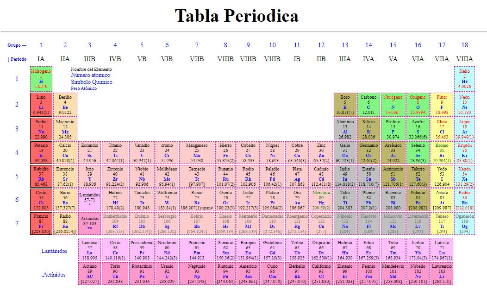

# Periodic Table

 Periodic table or periodic system is a scheme that shows the structure and arrangement of chemical elements according to a law of periodicity, which is that "the properties of the elements are a periodic function of their atomic numbers"

**More Information here :point_down:**
* **Link to Information**  [Periodic Table](https://www.sigmaaldrich.com/DO/es/technical-documents/technical-article/chemistry-and-synthesis/organic-reaction-toolbox/periodic-table-of-elements-names).

**Link to the project here :point_down:**
* **Link to Github Page** [Periodic Table](https://yhancarlospm.github.io/periodic-table-practice/).

 

***
© 2022 Yhancarlos Pérez

